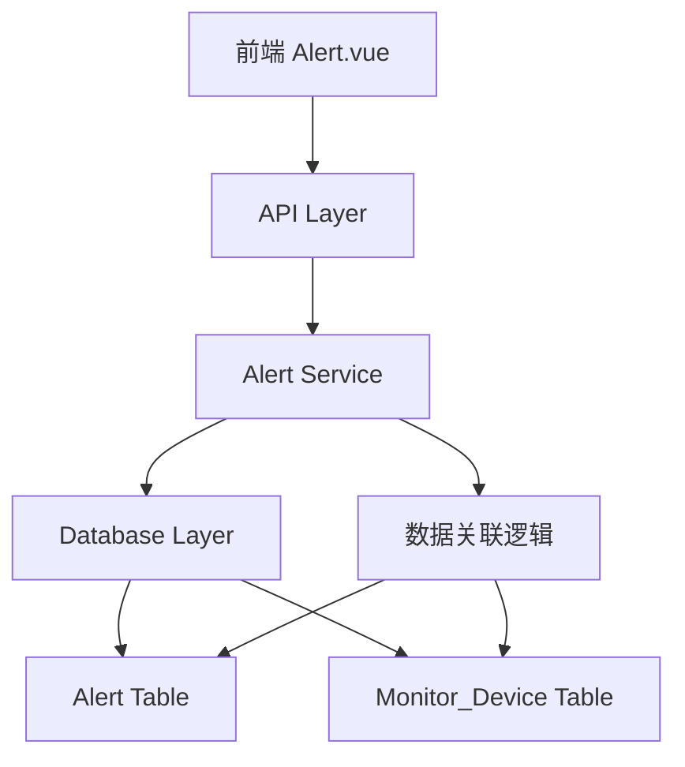
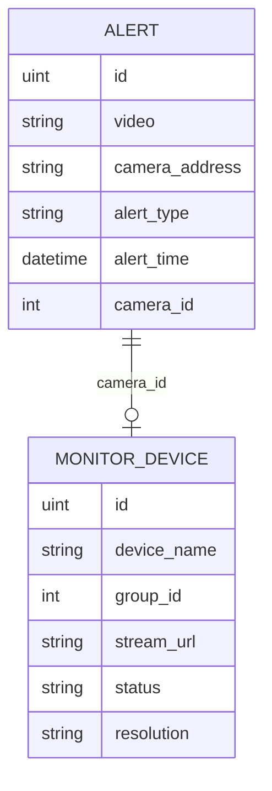

# 告警显示增强功能设计文档

## 概述

本设计文档描述了如何改进现有的告警显示系统，通过关联monitor_device表数据来提供更丰富的告警信息展示。设计包括后端API增强、前端界面优化和数据结构改进。

## 架构

### 系统架构图



### 数据流程

1. 前端发起告警列表请求
2. 后端API接收请求并调用服务层
3. 服务层执行关联查询（Alert LEFT JOIN Monitor_Device）
4. 返回包含设备信息的告警数据
5. 前端渲染增强的告警卡片

## 组件和接口

### 后端组件设计

#### 1. 数据模型增强

**AlertWithDevice 结构体**
```go
type AlertWithDevice struct {
    Alert
    DeviceName   *string `json:"deviceName"`
    DeviceStatus *string `json:"deviceStatus"`
    Resolution   *string `json:"resolution"`
    StreamUrl    *string `json:"streamUrl"`
    GroupId      *int    `json:"groupId"`
}
```

#### 2. 服务层增强

**GetAlertInfoListWithDevice 方法**
- 执行LEFT JOIN查询关联monitor_device表
- 返回包含设备信息的告警列表
- 支持按设备状态筛选
- 支持设备名称模糊搜索

#### 3. API接口增强

**GetAlertList接口改进**
- 增加设备状态筛选参数
- 增加设备名称搜索参数
- 返回数据包含设备详细信息

### 前端组件设计

#### 1. 告警卡片组件增强

**设备状态指示器**
- 在线状态：绿色圆点 + "在线"文字
- 离线状态：红色圆点 + "离线"文字  
- 故障状态：橙色圆点 + "故障"文字

**卡片信息展示**
- 设备名称（来自monitor_device表）
- 摄像头点位（原有字段）
- 设备状态（带颜色指示器）
- 预警类型
- 预警时间
- 分辨率信息

#### 2. 筛选组件增强

**新增筛选项**
- 设备状态多选框（在线/离线/故障）
- 设备名称搜索框

#### 3. 详情弹窗增强

**新增显示字段**
- 设备名称
- 设备状态（带状态描述）
- 视频流地址
- 分辨率
- 关联分组ID

## 数据模型

### 数据库关联关系



### API响应数据结构

```json
{
  "code": 0,
  "data": {
    "list": [
      {
        "ID": 1,
        "video": "video_path",
        "cameraAddress": "摄像头位置",
        "alertType": "人员入侵",
        "alertTime": "2025-01-27T10:00:00Z",
        "cameraId": 1,
        "deviceName": "前门监控",
        "deviceStatus": "1",
        "resolution": "1920x1080",
        "streamUrl": "rtmp://example.com/stream",
        "groupId": 1
      }
    ],
    "total": 100,
    "page": 1,
    "pageSize": 6
  },
  "msg": "获取成功"
}
```

## 错误处理

### 数据关联错误处理

1. **设备不存在情况**
   - 当camera_id对应的设备不存在时，设备相关字段返回null
   - 前端显示默认的设备信息占位符

2. **数据库连接错误**
   - 返回标准错误响应
   - 前端显示友好的错误提示

3. **权限验证错误**
   - 保持现有的权限验证机制
   - 未授权访问返回401状态码

### 前端错误处理

1. **API请求失败**
   - 显示网络错误提示
   - 提供重试机制

2. **数据格式错误**
   - 使用默认值填充缺失字段
   - 记录错误日志

## 测试策略

### 单元测试

1. **后端服务测试**
   - 测试关联查询逻辑
   - 测试筛选条件处理
   - 测试错误情况处理

2. **前端组件测试**
   - 测试卡片渲染逻辑
   - 测试状态指示器显示
   - 测试筛选功能

### 集成测试

1. **API集成测试**
   - 测试完整的数据流程
   - 测试各种筛选条件组合
   - 测试分页功能

2. **前后端集成测试**
   - 测试数据传输正确性
   - 测试用户交互流程
   - 测试错误处理机制

### 性能测试

1. **数据库查询性能**
   - 测试关联查询的执行时间
   - 优化索引配置
   - 测试大数据量情况

2. **前端渲染性能**
   - 测试大量卡片渲染性能
   - 优化虚拟滚动（如需要）

## 实现注意事项

### 数据库优化

1. **索引优化**
   - 在alert表的camera_id字段上创建索引
   - 在monitor_device表的id字段上确保主键索引

2. **查询优化**
   - 使用LEFT JOIN避免数据丢失
   - 只查询必要的字段减少数据传输

### 前端性能优化

1. **组件优化**
   - 使用Vue的key属性优化列表渲染
   - 实现图片懒加载

2. **状态管理**
   - 合理使用响应式数据
   - 避免不必要的重新渲染

### 兼容性考虑

1. **向后兼容**
   - 保持现有API接口的基本功能
   - 新增字段使用可选类型

2. **渐进式增强**
   - 即使设备信息缺失也能正常显示告警
   - 提供降级方案